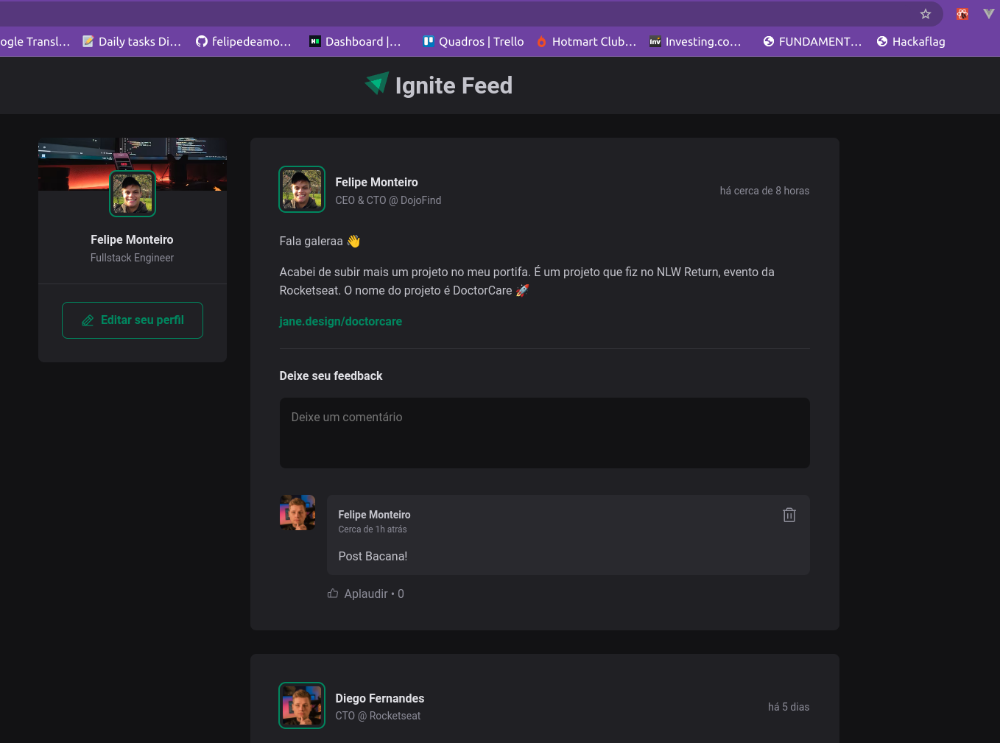

# 01 - Fundamentos Reactjs + Typescript

Este projeto conta com fundamentos do react para montar o projeto Ignite Feed:



Figma do projeto: [link](https://www.figma.com/design/J2WVkChUnJvFRqwkPPQ9Tg/Ignite-Feed-(Community)?node-id=1-35&t=Rw0pHWY6n6yRusqP-0)

## Como rodar

O projeto foi feito com `Node` na versão `v20.10.0`.

Primeiramente intale as dependências:
```
npm install
```
E depois rode:
```
npm run dev
```