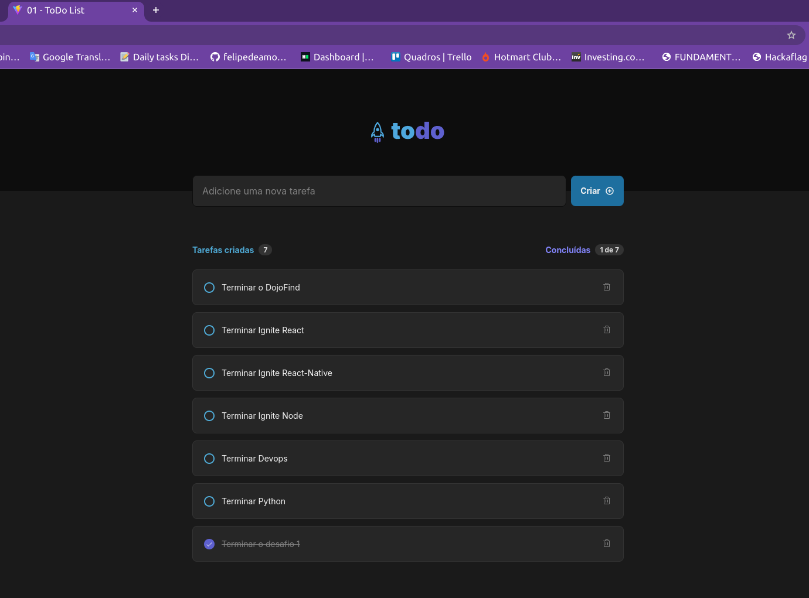

# Desafio 01 - Praticando os conceitos do ReactJS

Aqui eu copiei o texto para resolver o desafio.

# Sobre o desafio

Nesse desafio, você vai desenvolver uma aplicação de controle de tarefas no estilo **to-do list**, que contém as seguintes funcionalidades:

- Adicionar uma nova tarefa
- Marcar e desmarcar uma tarefa como concluída
- Remover uma tarefa da listagem
- Mostrar o progresso de conclusão das tarefas

Apesar de serem poucas funcionalidades, você vai precisar relembrar conceitos como:

- Estados
- Imutabilidade do estado
- Listas e chaves no ReactJS
- Propriedades
- Componentização

Para completar esse desafio, você pode necessitar de pesquisas para aprender sobre métodos de manipulação de arrays como `map`, `filter`  ou até mesmo `reduce`. 

Caso queira se aprofundar ainda mais em conceitos do React, recomendamos ler a nova documentação beta do React, que explica profundamente sobre conceitos do React e como pensar no design de aplicações React.

Figma da aplicação: [link](https://www.figma.com/file/d41zqVJRI0MSoyv6dPu8RX/ToDo-List-%E2%80%A2-Desafio-React-Copy?fuid=895716758038981057)

## Como rodar e Layout

O projeto foi feito com `Node` na versão `v20.10.0`.

Primeiramente intale as dependências:
```
npm install
```
E depois rode:
```
npm run dev
```
Layout da aplicação finalizada:
